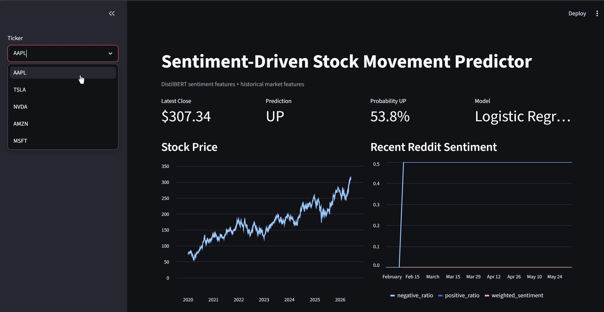
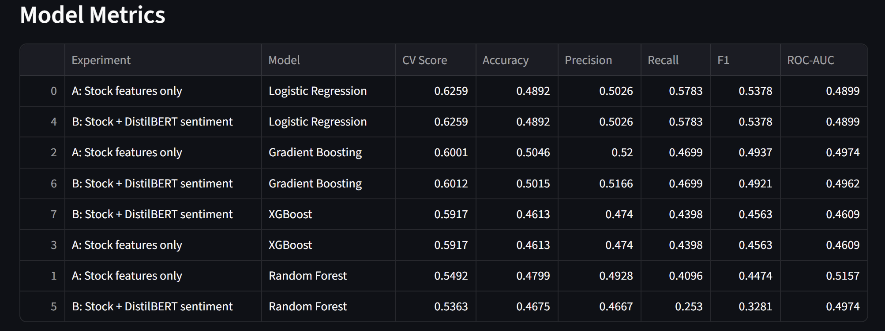
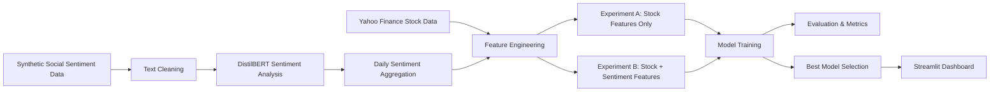

# 📈 AI-Powered Stock Movement Predictor using DistilBERT and Machine Learning

Predict whether a stock will move **UP** or **DOWN** on the next trading day using historical stock market data, Transformer-based sentiment analysis, and machine learning models.

---

## 🎥 Project Demo

<a href="./assets/demo.mp4">▶ Watch Demo Video</a>
---

## 📱 Dashboard Preview

### Dashboard Overview



### Model Metrics



---

## 🚀 Project Overview

This project demonstrates an end-to-end Artificial Intelligence and Machine Learning workflow that combines:

* Financial Market Analysis
* Natural Language Processing (NLP)
* DistilBERT Sentiment Analysis
* Feature Engineering
* Machine Learning Model Comparison
* Interactive Data Visualization

The system collects historical stock market data from Yahoo Finance, generates sentiment-based features using DistilBERT, engineers technical indicators, and predicts next-day stock movement using multiple machine learning algorithms.

An interactive Streamlit dashboard enables stock analysis, prediction visualization, model comparison, and performance evaluation.

---

## 🎯 Problem Statement

Stock prices are influenced by both historical market behavior and investor sentiment.

This project investigates:

> Can sentiment-based features improve stock movement prediction when combined with traditional financial indicators?

To answer this question, two experiments are performed:

### Experiment A

**Stock Features Only**

### Experiment B

**Stock Features + DistilBERT Sentiment Features**

The performance of both approaches is compared using multiple evaluation metrics.

---

## 🏗️ System Architecture



---

## 📊 Supported Stocks

| Company   | Ticker |
| --------- | ------ |
| Apple     | AAPL   |
| Tesla     | TSLA   |
| NVIDIA    | NVDA   |
| Amazon    | AMZN   |
| Microsoft | MSFT   |

---

## 📈 Dataset Statistics

### Historical Market Data

* Source: Yahoo Finance (`yfinance`)
* Supported Stocks: 5
* Records per Stock: ~1,616
* Total Historical Records: **8,000+**
* Financial Features Engineered: **15+**

### Sentiment Data

The current version uses synthetic Reddit-style financial discussions generated for educational and experimental purposes.

DistilBERT is used to generate sentiment-based features including:

- Average Sentiment
- Weighted Sentiment
- Positive Ratio
- Negative Ratio
- Sentiment Momentum
- Post Count
- Average Post Score
- Average Comment Count

> Note: Real Reddit API integration is planned as a future enhancement. The current implementation demonstrates the complete NLP and sentiment-analysis pipeline using generated financial discussion data.

---

## 🧠 Technologies Used

### Programming

* Python

### Data Collection

* yfinance

### Data Processing

* pandas
* numpy

### NLP

* Hugging Face Transformers
* DistilBERT

### Machine Learning

* Scikit-Learn
* XGBoost

### Visualization & Deployment

* Matplotlib
* Streamlit

---

## 🤖 DistilBERT Sentiment Analysis

The project uses:

```text
distilbert-base-uncased-finetuned-sst-2-english
```

DistilBERT is a lightweight version of BERT that retains much of BERT's language understanding capability while requiring significantly fewer computational resources.

### Sentiment Pipeline

1. Clean text data
2. Tokenize text using DistilBERT tokenizer
3. Generate sentiment predictions
4. Aggregate daily sentiment metrics
5. Merge sentiment features with stock market indicators
6. Train predictive machine learning models

---

## 📈 Feature Engineering

### Financial Features

* Daily Return
* 3-Day Return
* 7-Day Return
* 5-Day Moving Average
* 10-Day Moving Average
* Volume Change Percentage
* Rolling Volatility

### Sentiment Features

* Average Sentiment Score
* Weighted Sentiment
* Positive Ratio
* Negative Ratio
* Sentiment Momentum
* Post Count
* Average Score
* Average Number of Comments

---

## 🎯 Prediction Target

The model predicts:

```python
target = 1
```

when:

```python
next_day_close > current_day_close
```

otherwise:

```python
target = 0
```

| Value | Meaning                     |
| ----- | --------------------------- |
| 1     | Stock Expected to Move UP   |
| 0     | Stock Expected to Move DOWN |

---

## 🧪 Machine Learning Models

The project evaluates multiple classification algorithms:

### Logistic Regression

Baseline linear classifier.

### Random Forest

Tree-based ensemble model.

### Gradient Boosting

Boosted decision-tree classifier.

### XGBoost

Optimized gradient boosting framework.

---

## 📏 Evaluation Metrics

Models are evaluated using:

* Accuracy
* Precision
* Recall
* F1 Score
* ROC-AUC

Validation Strategy:

* Train/Test Split
* 5-Fold Cross Validation

---

## 📊 Experimental Results

### Model Performance

| Experiment                   | Model               | F1 Score   |
| ---------------------------- | ------------------- | ---------- |
| Stock Features Only          | Logistic Regression | **0.5378** |
| Stock + DistilBERT Sentiment | Logistic Regression | **0.5378** |
| Stock Features Only          | Gradient Boosting   | 0.4937     |
| Stock + DistilBERT Sentiment | Gradient Boosting   | 0.4921     |

### Key Findings

* Processed **8,000+ historical stock market records**
* Evaluated **4 machine learning models**
* Compared stock-only and sentiment-enhanced feature sets
* Logistic Regression achieved the highest F1 Score (**0.5378**)
* Built an interactive dashboard for stock prediction and analysis


### Current Implementation Notes

- Historical stock data is collected from Yahoo Finance using `yfinance`.
- Sentiment features are generated using DistilBERT on synthetic Reddit-style financial discussions.
- The project demonstrates the complete end-to-end NLP + ML workflow and can be extended to live Reddit API data with minimal changes.

### Observations

The current implementation demonstrates the complete AI/ML workflow using generated sentiment signals.

Results indicate that sentiment-enhanced models performed similarly to stock-only models, highlighting the importance of high-quality real-world sentiment data for financial forecasting.

---

## 📂 Project Structure

```text
sentiment_stock_predictor/
│
├── assets/
│   ├── dashboard_overview.png
│   ├── model_metrics.png
│   └── demo.mp4
│
├── data/
│
├── models/
│
├── notebooks/
│
├── outputs/
│
├── src/
│   ├── data_fetcher.py
│   ├── reddit_scraper.py
│   ├── sentiment_analyzer.py
│   ├── feature_engineering.py
│   ├── train_model.py
│   ├── predict.py
│   └── run_pipeline.py
│
├── app.py
├── config.yaml
├── requirements.txt
└── README.md
```

---

## ⚙️ Installation

Clone the repository:

```bash
git clone <repository-url>
cd sentiment_stock_predictor
```

Create a virtual environment:

```bash
python -m venv .venv
```

Activate the environment:

### Windows

```bash
.venv\Scripts\activate
```

Install dependencies:

```bash
pip install -r requirements.txt
```

---

## ▶️ Running the Project

### Run a Single Stock

```bash
python src/run_pipeline.py --ticker AAPL --demo-reddit
```

### Run All Supported Stocks

```bash
python src/run_pipeline.py --demo-reddit
```

### Launch Dashboard

```bash
streamlit run app.py
```

---

## 📂 Generated Outputs

### Models

```text
models/
└── best_model.joblib
```

### Metrics

```text
outputs/
├── model_metrics.csv
├── classification_report.txt
├── best_model_summary.json
├── confusion_matrix.png
├── roc_curve.png
├── feature_importance.png
└── feature_importance.csv
```

### Processed Datasets

```text
data/processed/
├── AAPL_features.csv
├── TSLA_features.csv
├── NVDA_features.csv
├── AMZN_features.csv
└── MSFT_features.csv
```

---

## 🔮 Future Improvements

### NLP

* Live Reddit API Integration
* Financial News Sentiment Analysis
* Reddit Comment Analysis
* Finance-Specific DistilBERT Fine-Tuning


---


## 👩‍💻 Author

**Indrayani Mude**

B.Tech Computer Engineering

AI • Machine Learning • Data Science • NLP


---

## 📄 License

This project is licensed under the MIT License - see the LICENSE file for details.
